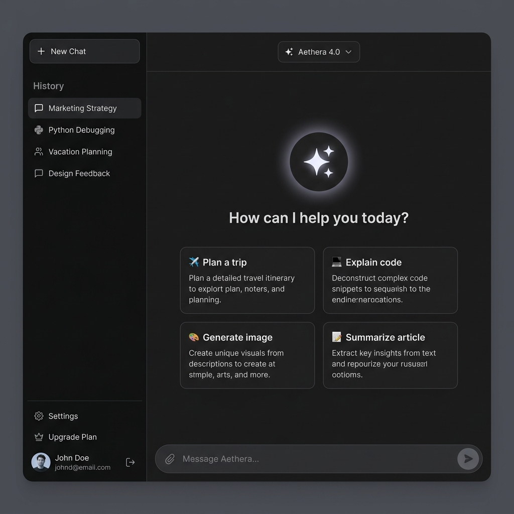
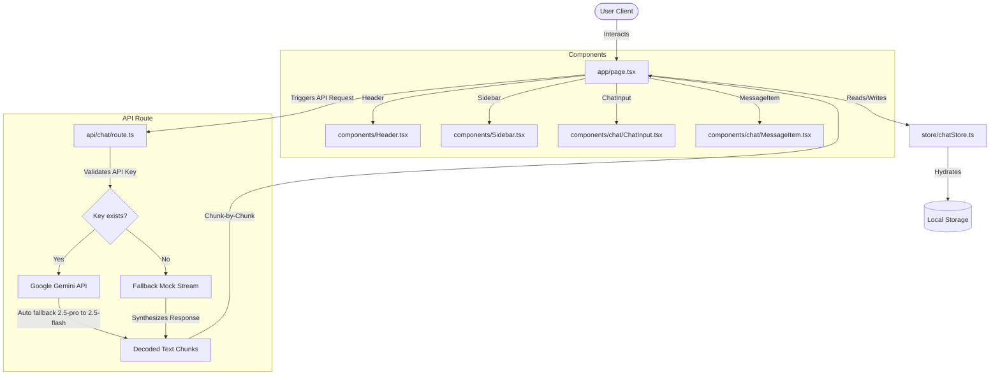

# Aethera AI - Minimalist Assistant

Aethera is a premium, ultra-minimalist AI chatbot interface inspired by ChatGPT and Claude, built with React, Next.js (App Router), TypeScript, and Tailwind CSS.

---

## 📸 Dashboard Mockup

Here is how the Aethera dashboard looks in dark mode:



---

## 🌟 Key Features

* **Calm & Spacious Design**: Full-screen layout with pure white background in Light Mode and dark zinc charcoal in Dark Mode. Avoids clutter, animations except for layout fade-ins.
* **Centered-to-Chat Transition**: The greeting screen centers a small logo and prompt area, which slides down to the bottom once the first query is sent.
* **Interactive Prompt Suggestion Cards**: A 2x2 grid of prompt suggestions sits in the center of the landing screen. Clicking a chip auto-populates the chat input and focuses the textarea.
* **Collapsible Left Sidebar**: View recent chat history, rename thread titles, delete threads, and access visual settings.
* **ChatGPT Bubble Styling**:
  - User messages sit inside clean rounded gray/zinc bubbles on the right.
  - AI responses flow left-aligned directly on the clean page background (no bubble borders).
* **Gemini API Integration**: Direct streaming connection to the Google Gemini developer API with automatic pro-to-flash fallback routing.
* **Robust Fallback Engine**: If no API key is set, the app runs on high-fidelity mock streams.

---

## 🛠️ Technology Stack

* **Framework**: Next.js 15 (App Router, Turbopack)
* **Language**: TypeScript
* **Styling**: Tailwind CSS v4.0
* **Animations**: Framer Motion
* **Markdown Parser**: React Markdown with GFM extensions (for tables and lists)
* **State Manager**: Zustand (with localStorage persistence)

---

## 📊 Application Architecture Flow

The diagram below details the data flow and component layout of Aethera:



---

## 📁 Project Structure

Here is a tree listing the primary directories and files within the codebase:

```text
ai-research-assistant/
├── public/
│   └── aethera_dashboard_mockup.png     # Dashboard screenshot mockup
├── src/
│   ├── app/
│   │   ├── api/
│   │   │   └── chat/
│   │   │       └── route.ts             # API route to fetch & stream Gemini responses
│   │   ├── globals.css                  # Core CSS variables, markdown prose settings
│   │   ├── layout.tsx                   # Main HTML layout, anti-flash configuration
│   │   └── page.tsx                     # Landing controller & layout coordinator
│   ├── components/
│   │   ├── chat/
│   │   │   ├── ChatInput.tsx            # Auto-resizing message textarea with attachment pill
│   │   │   ├── CodeBlock.tsx            # Markdown code rendering with line numbers
│   │   │   └── MessageItem.tsx          # Custom user/assistant bubbles with copy tools
│   │   ├── settings/
│   │   │   └── SettingsDialog.tsx       # Theme, font-size, and API model settings
│   │   ├── Header.tsx                   # Top navbar with model selector & theme toggle
│   │   └── Sidebar.tsx                  # Collapsible left column listing chat history
│   ├── store/
│   │   └── chatStore.ts                 # Zustand store persisting threads & active settings
│   └── types/
│       └── chat.ts                      # TypeScript definitions (Message, Settings, etc.)
├── .env.local                           # Local environment key (git-ignored)
├── tailwind.config.js                   # Tailwind CSS configuration
└── tsconfig.json                        # Strict TypeScript compilation rules
```

---

## 🚀 Local Setup & Ingestion

### Prerequisites
Make sure you have Node.js (version 18+) installed.

### 1. Clone & Install
```bash
cd ai-research-assistant
npm install
```

### 2. Configure Environment Variables
Create a `.env.local` file in the root folder:
```env
GEMINI_API_KEY=your_google_gemini_api_key_here
```
> **Security Warning**: The `.env.local` file is listed in `.gitignore` and will never be committed to public repositories.

### 3. Run Development Server
```bash
npm run dev
```
Open **[http://localhost:3000](http://localhost:3000)** in your web browser.

### 4. Build for Production
```bash
npm run build
```
